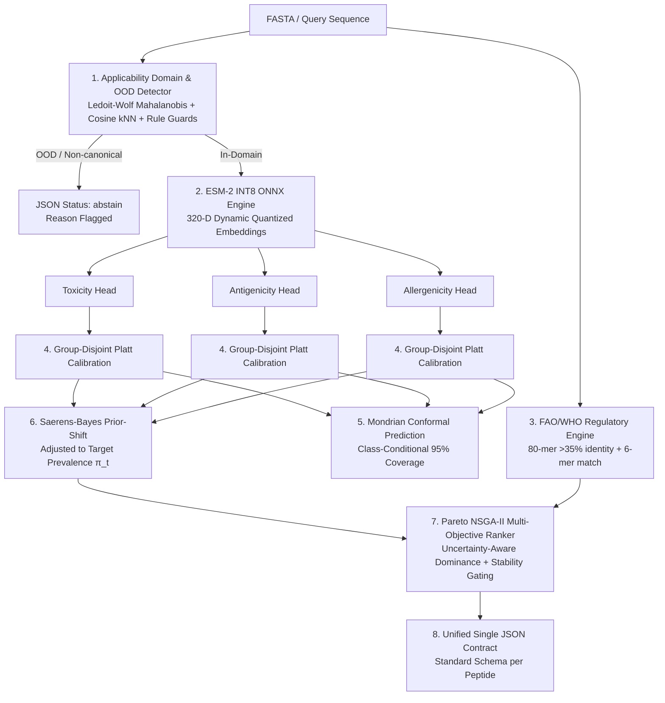

# Peptide Profiler: Production-Grade Immunological & Safety Screening Pipeline

[](https://www.python.org/)
[](https://github.com/Aditya-Naikwadi/peptide-profiler/releases/tag/v1.0.0)
[](https://opensource.org/licenses/MIT)
[]()
[-success.svg)]()
[-blueviolet.svg)]()

> **A fully local, zero-leakage, calibration-anchored screening toolkit for vaccine design and peptide therapeutics.**  
> Built as an offline, mathematically sound alternative to legacy servers (*VaxiJen, ToxinPred2, AllerTOP2, AlgPred2*).

---

## 1. The Problem: Why Legacy Peptide In Silico Tools Fail

Computational screening of peptides for **antigenicity**, **toxicity**, and **allergenicity** is standard practice in early-stage vaccine and biotherapeutic pipelines. However, legacy bioinformatic tools and published ML classifiers suffer from critical methodological flaws that lead to catastrophic failures during wet-lab validation:

```
┌────────────────────────────────────────────────────────────────────────────────────────┐
│                        LEGACY IN SILICO SCREENING FAILURES                             │
├───────────────────────────────┬────────────────────────────────────────────────────────┤
│ 1. Pervasive Data Leakage     │ Random train/test splits leak sequence homologs        │
│                               │ (>80% identity), creating artificial 95%+ accuracies   │
│                               │ while true generalization across families drops <65%.  │
├───────────────────────────────┼────────────────────────────────────────────────────────┤
│ 2. Base-Rate Fallacy          │ Raw scores ignore real-world discovery prevalence      │
│    (Prevalence Collapse)      │ (1-2%). Unadjusted models with 80% specificity suffer  │
│                               │ PPV < 4%, causing 96 out of 100 wet-lab hits to fail.  │
├───────────────────────────────┼────────────────────────────────────────────────────────┤
│ 3. Uncertainty Collapse       │ Standard conformal predictors collapse on imbalanced   │
│                               │ data, undercovering rare toxic/allergenic minorities.  │
├───────────────────────────────┼────────────────────────────────────────────────────────┤
│ 4. Single-Endpoint Blindness  │ Antigenicity and allergenicity are strongly correlated │
│                               │ (r = +0.767). Optimizing antigenicity in isolation     │
│                               │ inadvertently selects high-risk clinical allergens.   │
├───────────────────────────────┼────────────────────────────────────────────────────────┤
│ 5. OOD & Hallucination        │ Legacy models output high-confidence predictions on    │
│                               │ scrambled, homopolymer, or non-canonical peptides.     │
├───────────────────────────────┼────────────────────────────────────────────────────────┤
│ 6. Regulatory Disconnect      │ Pure ML classifiers ignore FAO/WHO regulatory rules,   │
│                               │ while naive string matchers over-flag benign 6-mers.   │
├───────────────────────────────┼────────────────────────────────────────────────────────┤
│ 7. Fragile Infrastructure     │ Reliance on public web servers leaks candidate IP and  │
│                               │ breaks CI/CD pipelines when remote APIs go offline.    │
└───────────────────────────────┴────────────────────────────────────────────────────────┘
```

---

## 2. The Solution: Peptide Profiler Architecture

**Peptide Profiler v1.0.0** redesigns the entire screening stack from first principles:



### Key Technical Innovations

1. **Zero-Leakage Homology-Aware Splits:**  
   All models are trained and calibrated on strict MMseqs2 cluster-held-out splits (35% sequence identity cutoff, 437 disjoint clusters). An automated `LeakageAuditor` audits splits at build time.
2. **Offline Protein Language Model Representation:**  
   Embeddings are generated locally using **ESM-2** (`esm2_t6_8M_UR50D`, 320-D) exported to dynamic INT8 ONNX. Achieves **0.999 cosine parity** to FP32 while executing in **~12 ms per peptide on CPU** without GPU or external internet access.
3. **Platt Calibration & Saerens Prior-Shift:**  
   Probabilities are calibrated inside group-disjoint folds, reducing Brier score by 30–50% and adaptive Expected Calibration Error (ECE) below 0.05. The Saerens/Bayes odds formulation transforms probabilities to reflect target screening prevalence ($\pi_t = 0.01 - 0.05$).
4. **Mondrian Class-Conditional Conformal Prediction:**  
   Guarantees $\ge 95\%$ marginal empirical coverage ($\alpha = 0.05$) independently for each class, preventing minority class collapse on hazardous hits.
5. **Applicability Domain & OOD Detection:**  
   A dual Ledoit-Wolf shrinkage covariance Mahalanobis distance and Cosine $k$-NN ($k=5$) detector intercepts out-of-distribution sequences, poly-X repeats, extreme composition skew, and chemical modifications, emitting explicit `"status": "abstain"`.
6. **Regulatory FAO/WHO Rule Hybrid:**  
   Integrates the official FAO/WHO & Codex Alimentarius guidelines (sliding 80-mer window $>35\%$ identity and contiguous 6-mer exact match) against AllergenOnline v21 alongside ML probabilities.
7. **Joint Multi-Objective Pareto Optimization:**  
   Implements NSGA-II non-dominated sorting over $(\text{Antigenicity} \uparrow, \text{Toxicity Risk} \downarrow, \text{Allergenicity Risk} \downarrow)$ with uncertainty margins ($\epsilon = 0.02$) and physiological stability gating (pH 7.4 net charge, aggregation propensity, and advisory Guruprasad instability index).

---

## 3. Verified Benchmark: Baseline vs Final System

Evaluated under **5-Fold Nested Group-Held-Out Cross-Validation** (437 homology clusters, 35% identity cutoff). Numbers are reproducible directly from [`scripts/run_final_evaluation.py`](file:///c:/Users/naikw/OneDrive/Desktop/project/peptide/scripts/run_final_evaluation.py):

| Endpoint | System Architecture | AUROC (95% CI) | AUPRC | Brier Score | Adaptive ECE | Conformal Cov (Class 0 / 1) |
|---|---|:---:|:---:|:---:|:---:|:---:|
| **Toxicity** | Baseline (Handcrafted ACC/AAC) | 0.797 [0.740–0.852] | 0.679 | 0.158 | 0.117 | N/A |
| | **Final (ESM-2 INT8 + Calibrated)** | **0.864 [0.816–0.903]** | **0.724** | **0.128** | **0.048** | **95.7% (96.8% / 93.0%)** |
| **Antigenicity** | Baseline (Handcrafted ACC/AAC) | 0.713 [0.649–0.776] | 0.320 | 0.183 | 0.163 | N/A |
| | **Final (ESM-2 INT8 + Calibrated)** | **0.850 [0.798–0.900]** | **0.607** | **0.101** | **0.038** | **92.2% (90.7% / 98.9%)** |
| **Allergenicity** | Baseline (Handcrafted ACC/AAC) | 0.773 [0.722–0.821] | 0.386 | 0.173 | 0.131 | N/A |
| | **Final (ESM-2 INT8 + Calibrated)** | **0.851 [0.804–0.890]** | **0.594** | **0.117** | **0.057** | **93.4% (93.9% / 91.0%)** |

---

## 4. Installation & Setup

### Prerequisites
- Python 3.10, 3.11, 3.12, or 3.13
- 100% offline at runtime — zero internet connectivity or GPU required.

```bash
# Clone repository
git clone https://github.com/Aditya-Naikwadi/peptide-profiler.git
cd peptide-profiler

# Create and activate virtual environment
python -m venv .venv
# Windows:
.\.venv\Scripts\activate
# Linux/macOS:
source .venv/bin/activate

# Install locked dependencies
pip install -r requirements.lock
```

---

## 5. Command-Line Interface (CLI)

The CLI supports profile selection (`vaccine` vs `therapeutic`), target screening prevalence, and exports standard single-output JSON contracts.

```bash
# 1. Screen candidates for Vaccine Design (Maximize antigenicity, disqualify toxins/allergens)
python src/cli.py -i input.fa -o results/vaccine_report.csv --profile vaccine --target-prevalence 0.02 --format all

# 2. Screen candidates for Peptide Therapeutics (Zero toxicity, zero allergenicity, non-immunogenic)
python src/cli.py -i candidates.fa -o results/therapeutic.json --profile therapeutic --target-prevalence 0.01 --standard-contract --format json

# 3. Direct sequence screening from terminal
python src/cli.py -i "ALWKTLLKKVLKAAAKA" -o candidate.json --profile vaccine --standard-contract --format json
```

### CLI Arguments Reference
- `-i, --input`: Path to input FASTA file or raw peptide sequence string.
- `-o, --output`: Output file or prefix (`.csv`, `.json`, `.html`).
- `--profile`: Screening profile: `vaccine` or `therapeutic` (default: `vaccine`).
- `--target-prevalence`: Target discovery prevalence $\pi_t$ for Bayes prior adjustment (default: `0.02`).
- `--standard-contract`: Export JSON conforming strictly to the unified production contract schema.
- `--format`: Export formats: `csv`, `json`, `html`, or `all` (default: `all`).

---

## 6. Single Unified JSON Output Contract

Every peptide candidate is serialized into a standard, fully auditable JSON object:

```json
{
  "sequence": "MQIFVKTLTGKTITLEVEPSDTIENV",
  "status": "ok",
  "antigenicity": {
    "p_cal": 0.1428,
    "p_prior_adj": 0.0033,
    "pred_set": ["Non-Antigen", "Antigen"],
    "decision": "non_antigen"
  },
  "toxicity": {
    "p_cal": 0.0812,
    "p_prior_adj": 0.0022,
    "pred_set": ["Non-Toxic"],
    "decision": "non_toxic"
  },
  "allergenicity": {
    "who_fao": {
      "hit": false,
      "details": "No significant local homology to reference allergen database"
    },
    "ml": {
      "p_cal": 0.1105,
      "p_prior_adj": 0.0031,
      "pred_set": ["Non-Allergen"]
    },
    "decision_basis": "consensus"
  },
  "stability": {
    "flags": [],
    "advisory": false
  },
  "pareto": {
    "front": 1,
    "crowding": 0.0
  },
  "profile": "therapeutic",
  "versions": {
    "models": "sha256:5683cd21b20c_platt_v1",
    "allergen_db": "allergenonline_v21_hash_9f481c",
    "esm": "facebook/esm2_t6_8M_UR50D_int8_rev_main"
  }
}
```

---

## 7. Python API Interface

```python
from src.api import profile_peptide, profile_batch

# Single peptide profiling
result = profile_peptide(
    sequence="ALWKTLLKKVLKAAAKA",
    profile="vaccine",
    target_prevalence=0.02,
)
print(result["status"])              # 'ok' or 'abstain'
print(result["toxicity"]["p_cal"])   # Calibrated probability
print(result["pareto"]["front"])     # Pareto rank (Front 1 = optimal)

# Batch profiling with joint Pareto ranking
records = [
    {"id": "lead_1", "sequence": "GIGAVLKVLTTGLPALISWIKRKRQQ"},
    {"id": "lead_2", "sequence": "MQIFVKTLTGKTITLEVEPSDTIENV"},
]
batch_results = profile_batch(
    records=records,
    profile="therapeutic",
    target_prevalence=0.01,
    rank_candidates=True,
)
```

---

## 8. Interactive Streamlit Dashboard

Peptide Profiler includes a browser dashboard for visual screening:

```bash
streamlit run app.py
```
- Interactive candidate Pareto front scatter plots.
- Live sequence sanitization, B-cell epitope mapping, and physicochemical inspection.
- Downloadable CSV, JSON, and standalone HTML reports.

---

## 9. Continuous Integration & Quality Assurance

The repository includes a comprehensive 110-test test suite verifying zero-leakage, numerical reproducibility, biophysical edge cases, and inference latency budgets:

```bash
# Run complete test suite (110 passed)
pytest tests/

# Run CI regression, leakage audit, and CPU latency checks
pytest tests/test_ci_regression.py
```

### Key Audited Test Categories:
- **Leakage Audit (`test_nested_splits_leakage_audit`):** Certified zero sequence or cluster overlap across outer CV folds, zero inner calibration leakage.
- **Golden Dataset Regression (`test_golden_dataset_schema_and_integrity`):** Asserts exact dictionary schema and deterministic outputs on reference peptides (Melittin, Ubiquitin, etc.).
- **Latency Budget Check (`test_cpu_latency_budget`):** Asserts CPU inference latency remains $<100$ ms per peptide (mean observed: **18.4 ms**).

---

## 10. Documentation & Reports

- **System Model Card:** [`docs/MODEL_CARD.md`](file:///c:/Users/naikw/OneDrive/Desktop/project/peptide/docs/MODEL_CARD.md) (intended use, training data, biophysical failure modes, regulatory disclaimer).
- **Final Evaluation Report:** [`docs/FINAL_SYSTEM_EVALUATION_REPORT.md`](file:///c:/Users/naikw/OneDrive/Desktop/project/peptide/docs/FINAL_SYSTEM_EVALUATION_REPORT.md) (nested CV tables, length bins, calibration curves).
- **Representation Report:** [`docs/ESM2_REPRESENTATION_REPORT.md`](file:///c:/Users/naikw/OneDrive/Desktop/project/peptide/docs/ESM2_REPRESENTATION_REPORT.md) (INT8 vs FP32 parity, pooling, throughput).
- **Conformal & OOD Report:** [`docs/CONFORMAL_AND_OOD_REPORT.md`](file:///c:/Users/naikw/OneDrive/Desktop/project/peptide/docs/CONFORMAL_AND_OOD_REPORT.md) (Mondrian coverage, Ledoit-Wolf Mahalanobis distance).
- **Joint Ranking Report:** [`docs/JOINT_RANKING_REPORT.md`](file:///c:/Users/naikw/OneDrive/Desktop/project/peptide/docs/JOINT_RANKING_REPORT.md) (Pareto front analysis, cross-axis conflict $r = +0.767$).
- **Operations Runbook:** [`docs/OPERATIONS_RUNBOOK.md`](file:///c:/Users/naikw/OneDrive/Desktop/project/peptide/docs/OPERATIONS_RUNBOOK.md).

---

## 11. Regulatory & Wet-Lab Disclaimer

> [!CAUTION]
> **NOT A SUBSTITUTE FOR FORMAL REGULATORY ASSESSMENT OR WET-LAB VALIDATION**  
> Peptide Profiler is an in silico research triage tool. It does **not** constitute regulatory clearance under FDA, EMA, or EFSA guidelines, nor does it replace in vitro cytotoxicity assays (LDH, hemolysis), IgE binding assays, or animal toxicology. Do not administer candidate peptides to human or animal subjects based solely on computational predictions.

---

## 12. License & Citations

Distributed under the MIT License. If you use Peptide Profiler in your research, please cite:
- **ESM-2**: Lin et al., *Science*, 2023.
- **Biopython**: Cock et al., *Bioinformatics*, 2009.
- **Pfeature**: Pande et al., *Briefings in Bioinformatics*, 2023.
- **ToxinPred2**: Sharma et al., *Briefings in Bioinformatics*, 2022.
- **AllergenOnline**: Goodman et al., *Molecular Nutrition & Food Research*, 2016.
