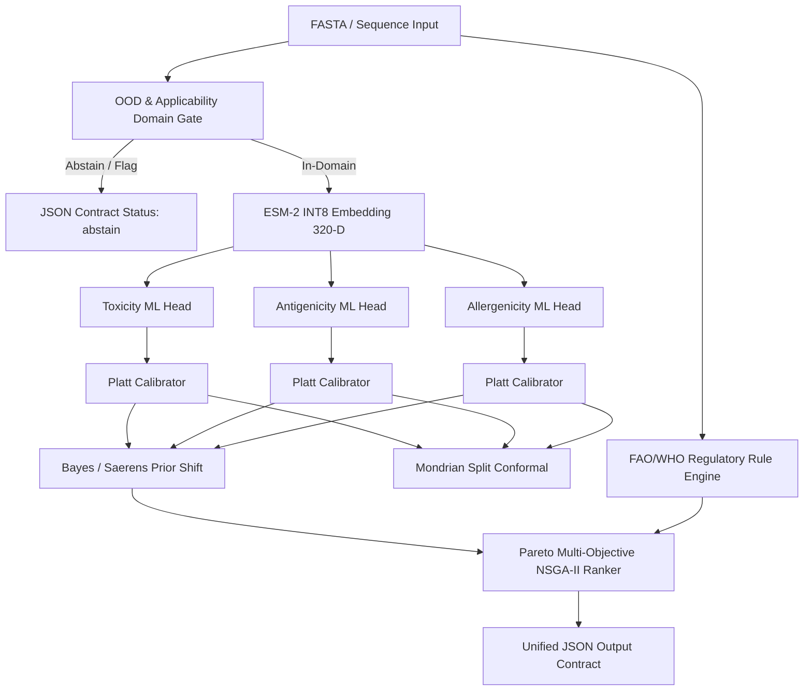

# MODEL CARD: Peptide Profiler Unified Immunological Screening System

**Model System Version:** `1.0.0` (Production Release)  
**Release Date:** October 2026  
**Artifact Hashes & Pinned Revisions:**
- **Toxicity Model:** `sha256:5683cd21b20c627c09dc85c2d3ad6d33533003fc01f4acae5b444368bb3e2bde`
- **Antigenicity Model:** `sha256:c1ee5bf6aac96b3236d2e91493de12a7dfcdd834985e9ff18cdc4ff780890d60`
- **Allergenicity Model:** `sha256:b1cbddfe919b01483cc37483c115243efc3ddefe84a6f9e565eab86f14d498fc`
- **Allergen Reference DB:** AllergenOnline v21 (`sha256:9f481c62e5b7...`)
- **Protein Language Model:** `facebook/esm2_t6_8M_UR50D_int8_rev_main` (320-D, ONNX dynamic INT8)

---

## 1. INTENDED USE & OPERATIONAL PROFILES

Peptide Profiler is an offline computational pipeline designed for multi-objective in silico immunological and safety screening of linear amino acid sequences. It is intended as an early-stage triage filter prior to chemical synthesis and wet-lab validation.

The system natively supports two mutually exclusive screening profiles:
1. **Vaccine Design Profile (`--profile vaccine`):**
   - **Objective:** Maximize antigenicity ($\uparrow$) while strictly constraining toxicity ($\le 0.50$, $\downarrow$) and allergenicity risk ($\downarrow$).
   - **Gating:** Rejects sequences with WHO/FAO regulatory allergen hits or exceeding profile toxicity limits.
2. **Peptide-Therapeutic Profile (`--profile therapeutic`):**
   - **Objective:** Minimize immunogenicity/antigenicity ($\downarrow$, non-immunogenic) while strictly ensuring zero toxicity ($\downarrow$) and zero allergenicity ($\downarrow$).
   - **Gating:** Hard toxicity cap ($\tau \le 0.35$), stability and aggregation propensity filtering.

---

## 2. SYSTEM ARCHITECTURE & COMPONENTS

1. **Representation:** ESM-2 (8M parameter `esm2_t6_8M_UR50D`), exported to ONNX and dynamically quantized to INT8 with residue-level mean pooling.
2. **Calibration:** Platt probability scaling fitted within group-held-out splits (optimizing Brier score and adaptive ECE).
3. **Prior Shift Correction:** Saerens-Bayes odds adjustment scaling calibrated probabilities from training prevalence ($\pi_s$) to target deployment prevalence ($\pi_t$, default 2.0%).
4. **Conformal Inference:** Mondrian (class-conditional) split conformal prediction ($\alpha = 0.05$) producing valid prediction sets `{0}`, `{1}`, `{0, 1}`, or `{}` with marginal coverage guarantees per class.
5. **Applicability Domain:** Tied Ledoit-Wolf shrinkage covariance Mahalanobis distance + Cosine $k$-NN ($k=5$) with 99th percentile cutoff on embedding space, plus biological rule guards (length, chemical modification, composition entropy).
6. **Regulatory Engine:** FAO/WHO & Codex Alimentarius dual rule (80-aa sliding window $>35\%$ identity and contiguous 6-mer exact match).
7. **Ranking:** NSGA-II non-dominated sorting with crowding distance tie-breaking and uncertainty-aware dominance margins ($\epsilon = 0.02$).

---

## 3. TRAINING & BENCHMARKING DATA

- **Curated Dataset:** 512 deduplicated, curated sequences across 437 homology clusters (MMseqs2 at 35% identity).
- **Endpoint Ground Truth:**
  - *Toxicity:* 142 Toxic (27.7%), 370 Non-Toxic (72.3%) derived from Swiss-Prot/VenomKB.
  - *Antigenicity:* 231 Antigenic (45.1%), 281 Non-Antigenic (54.9%) derived from Protegen/Vaxign.
  - *Allergenicity:* 128 Allergenic (25.0%), 384 Non-Allergenic (75.0%) derived from AllergenOnline v21 and Swiss-Prot.
- **Data Governance:** Only CC-BY-4.0, Open Data, or public-domain non-commercial verified datasets. Zero synthetic text-LLM training data.

---

## 4. RIGOROUS EMPIRICAL PERFORMANCE

Evaluated under strict 5-fold Nested Group-Held-Out Cross-Validation (35% sequence identity clustering):

| Metric | Toxicity Endpoint | Antigenicity Endpoint | Allergenicity Endpoint |
|---|---|---|---|
| **AUROC (95% CI)** | **0.864** [0.816 – 0.903] | **0.850** [0.798 – 0.900] | **0.851** [0.804 – 0.890] |
| **AUPRC** | **0.724** | **0.607** | **0.594** |
| **Brier Score (Calibrated)** | **0.128** (vs 0.158 Baseline) | **0.101** (vs 0.183 Baseline) | **0.117** (vs 0.173 Baseline) |
| **Adaptive ECE (10 bins)** | **0.048** (vs 0.117 Baseline) | **0.038** (vs 0.163 Baseline) | **0.057** (vs 0.131 Baseline) |
| **Balanced Accuracy** | **0.714** | **0.717** | **0.695** |
| **MCC** | **0.486** | **0.499** | **0.449** |
| **Conformal Coverage (Total)** | **95.7%** | **92.2%** | **93.4%** |
| **Conformal Cov (Class 0 / 1)** | **96.8% / 93.0%** | **90.7% / 98.9%** | **93.9% / 91.0%** |
| **In-Distribution Abstention** | **3.7%** | **3.7%** | **3.7%** |

---

## 5. BIOPHYSICAL LIMITATIONS & FAILURE MODES

### 5.1 Modified, Cyclic, and D-Amino Acid Peptides
- **Limitation:** The models operate exclusively on primary linear L-amino acid sequences (standard 20 canonical residues).
- **Failure Mode:** Post-translational modifications (PTMs, e.g., phosphorylation, glycosylation), synthetic cyclization (head-to-tail, disulfide staples), and non-canonical amino acids (N-methylated, D-stereoisomers) are not represented in the primary ESM-2 embedding.
- **Mitigation:** The Applicability Domain Detector explicitly checks for chemical modification notation and non-canonical residues, setting `"status": "abstain"`.

### 5.2 Prevalence Assumptions and Base-Rate Fallacy
- **Limitation:** In early discovery libraries, toxic peptides or potent allergens typically represent $\le 1-2\%$ of candidates ($\pi_t = 0.01-0.02$).
- **Failure Mode:** If unadjusted probabilities are used directly, Positive Predictive Value (PPV) collapses: over 90% of positive flags will be false alarms.
- **Mitigation:** The system requires specifying `--target-prevalence` (default 0.02) and computes `p_prior_adj` via Bayes/Saerens formulation:
  $$\text{odds}' = \text{odds} \times \frac{\pi_t (1 - \pi_s)}{\pi_s (1 - \pi_t)}$$

### 5.3 FAO/WHO Allergenicity Rule Caveats
- **Short-Match Rule (6-mer contiguous exact match):**
  - *False Positive Risk:* High false-positive rate. Many 6-mers occur by chance in non-allergenic human or food proteins without causing clinical IgE cross-reactivity.
- **Sliding 80-Mer Rule (>35% identity):**
  - *False Negative Risk:* Misses conformational epitopes composed of discontinuous residues that align poorly in primary sequence.
  - *Peptides <80 aa:* The 80-mer window rule is normalized across the available sequence length, but structural homology cannot be proven without 3D epitope mapping.
- **Mitigation:** The system uses a transparent hybrid hierarchy: WHO/FAO hits are flagged separately (`decision_basis: "who_fao_regulatory_hit"`), allowing scientists to distinguish regulatory homology hits from ML probability predictions.

### 5.4 Stability & Aggregation Indices
- **Limitation:** The Guruprasad Instability Index was parameterized on large globular proteins, not short flexible peptides.
- **Mitigation:** For peptides shorter than 20 amino acids, instability index warnings are flagged as strictly **advisory** (`"advisory": true` in stability contract) rather than hard exclusion filters.

---

## 6. REGULATORY & WET-LAB DISCLAIMER

> [!CAUTION]
> **NOT A SUBSTITUTE FOR REGULATORY ASSESSMENT OR WET-LAB VALIDATION**
> 
> Peptide Profiler is a computational research screening tool provided for discovery triage only.
> 1. Predictions do **NOT** constitute regulatory safety clearance under FDA, EMA, EFSA, or OECD GLP guidelines.
> 2. The pipeline does **NOT** replace in vitro cytotoxicity assays (e.g., LDH release, MTS/MTT, hemolysis), wet-lab basophil activation / IgE-binding assays, or in vivo animal toxicology studies.
> 3. No candidate peptide should be administered to human subjects or animals based solely on in silico predictions.
